

  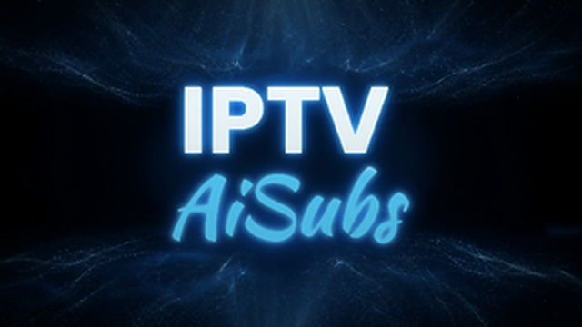

**IPTV player for Android TV, Fire TV and phones, with AI-generated subtitles.**

This repository publishes the sideload releases and hosts the public issue tracker. The app's source code is not public.

## Install

**[Download latest APK](https://github.com/noahqsoft/iptv-aisubs-releases/releases/latest/download/iptv-aisubs-fire.apk)** — Fire TV, Android TV boxes, phones without Google Play. All releases: [Releases](https://github.com/noahqsoft/iptv-aisubs-releases/releases).

Or install the [Downloader](https://www.aftvnews.com/downloader/) app on your Fire TV and enter code **6783914**.

On devices with Google Play, use the Play version, which updates itself: <https://play.google.com/store/apps/details?id=com.qsparks.iptv.aisubs>

The sideload APK is the Fire build: it does not depend on Google Play services. It tells you when a new version is out; install the new APK over the old one, your settings and data are kept. Both builds are signed with the same key, so one can be installed over the other.

Requirements: Android 8.0 or newer. Fire TV: Fire OS devices (Fire TV Stick, Fire TV Cube); the newer Vega OS devices cannot run Android APKs.

## Features

- **Live TV** from M3U playlists, Xtream Codes and Stalker portals, with EPG, a TV guide, catch-up and recording (DVR).
- **AI subtitles**: live speech recognition and translation on any stream, using your own API key at Soniox, Gladia, OpenAI, Gemini or Deepgram.
- **Movies and series**: TMDB details, ratings, trailers, cast pages and episode tracking; Stremio-compatible addons for sources, subtitles, trailers and recommendations.
- **Your media**: SMB and WebDAV shares, downloads, and control of Transmission or qBittorrent.
- **Web interface** on your local network for setup, playlists, addons and settings.
- **Profiles**, multiview, and settings sync between devices over SMB or WebDAV.
- Interface in English and Hungarian.

## Screenshots

<table>
  <tr>
    <td><a href="screenshots/library01.png">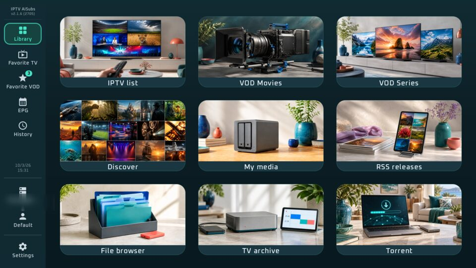</a> Library</td>
    <td><a href="screenshots/discover01.png">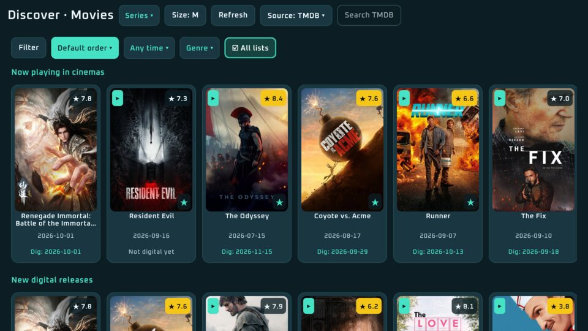</a> Discover: cinema and digital releases</td>
  </tr>
  <tr>
    <td><a href="screenshots/tmdb-details01.png">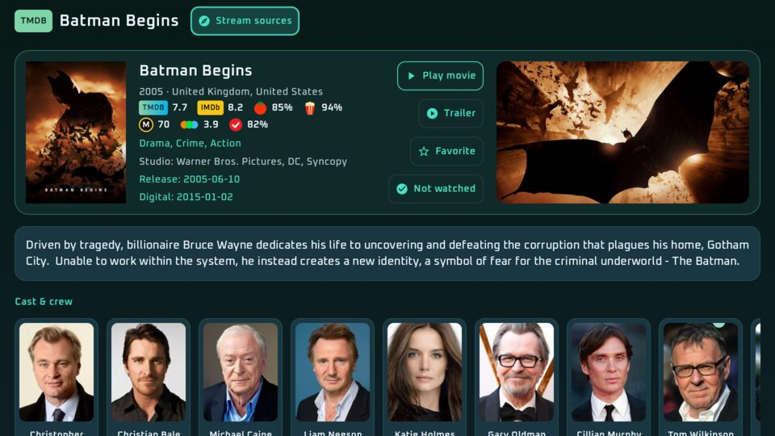</a> Title page: ratings, trailer, cast and sources</td>
    <td><a href="screenshots/tmdb-details02.png">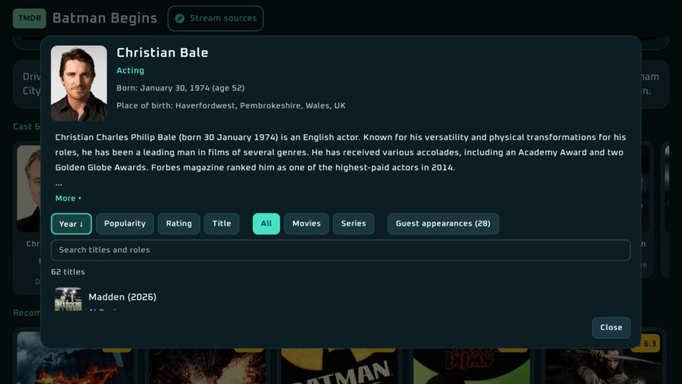</a> Actor page with sortable filmography</td>
  </tr>
  <tr>
    <td><a href="screenshots/episodetrack.png">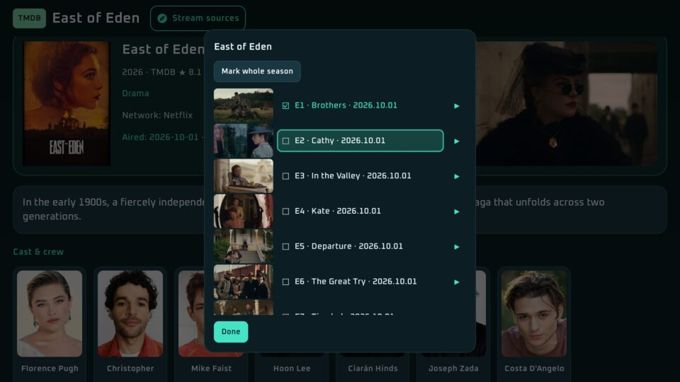</a> Episode tracking</td>
    <td><a href="screenshots/addons01.png">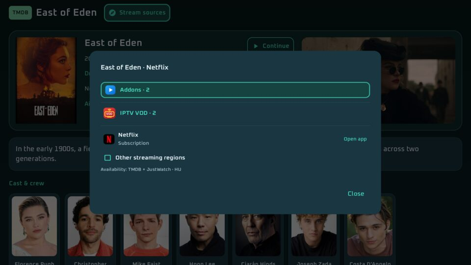</a> Where to watch: addons, IPTV VOD, streaming services</td>
  </tr>
  <tr>
    <td><a href="screenshots/EPG.png">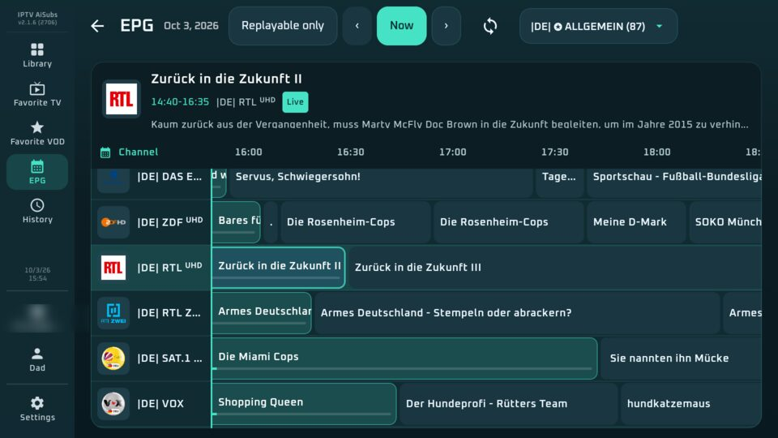</a> TV guide</td>
    <td><a href="screenshots/DVR-scheduler.png">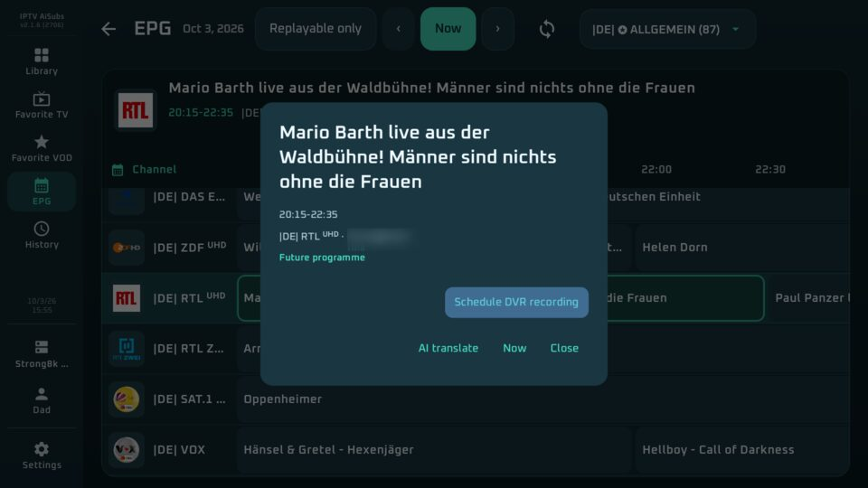</a> Recording from the guide</td>
  </tr>
  <tr>
    <td><a href="screenshots/settings.png">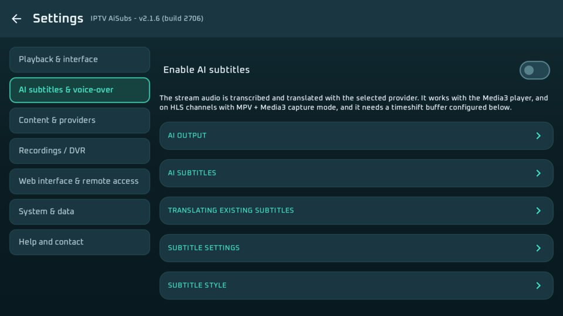</a> AI subtitles settings</td>
    <td><a href="screenshots/whoswatching.png">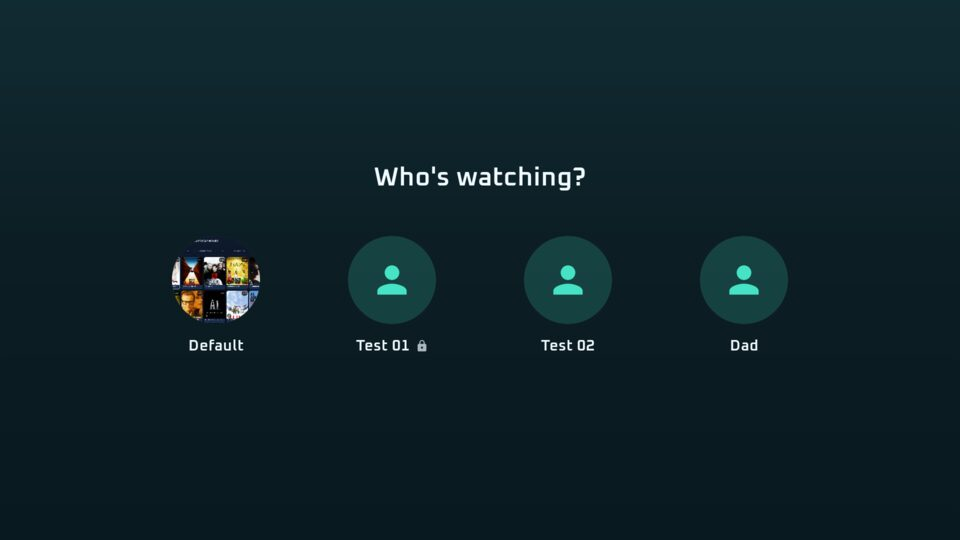</a> Profiles</td>
  </tr>
  <tr>
    <td colspan="2"><a href="screenshots/web-interface.png">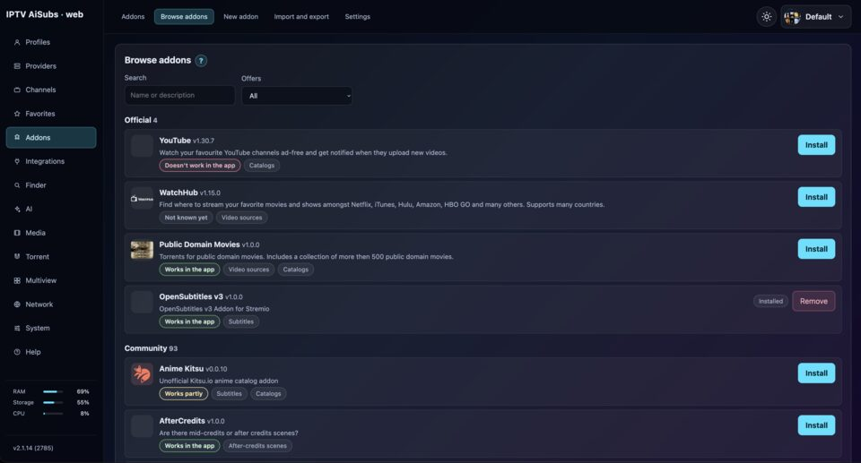</a> Web interface: browse and install addons from any browser on your network</td>
  </tr>
</table>

## Privacy

The app sends nothing on its own: no account, no analytics, no telemetry. It only talks to the services you configure — your IPTV provider, addons, metadata sources, and AI providers with your own keys.

## Content

IPTV AiSubs is a player. It does not include or provide channels, videos or subscriptions; you bring your own playlists, services and addons.

## Community

Questions, ideas and news: join the [Discord server](https://discord.gg/44sT7nwm8M).

## Bugs and requests

Use the [issue tracker](https://github.com/noahqsoft/iptv-aisubs-releases/issues). For playback or subtitle problems, attach the diagnostic log from the web interface (Overview → Diagnostics → masked download) and the build number shown in Settings. Remove anything private from the log before posting (playlist URLs with credentials, API keys).

## Changelog

See [CHANGELOG.md](CHANGELOG.md).

## Contact

iptv.aisubs@noahqsoft.com
